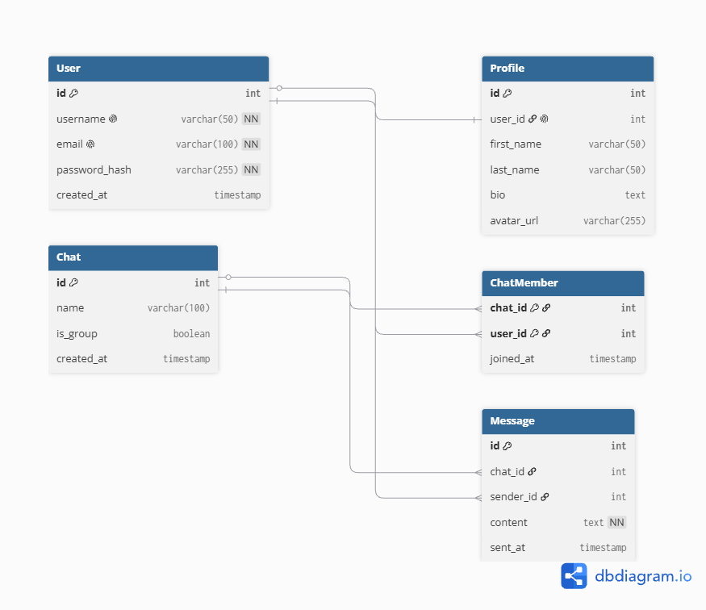

# Практична робота №3: Проєктна схема бази даних

Цей документ містить опис структури бази даних для проєкту **SwiftChat** — сервісу обміну повідомленнями в реальному часі.

---

## 1. Загальна ідея проєкту

**Назва:** SwiftChat (СвіфтЧат)  
**Опис:** Вебдодаток для швидкого та надійного обміну текстовими повідомленнями між користувачами. Підтримує приватні діалоги (тет-а-тет), групові чати та збереження профілів користувачів.  
**СУБД:** PostgreSQL (розгорнута в Docker-контейнері).

---

## 2. Логічна схема бази даних (ER-діаграма)



---

## 3. Специфікація сутностей та зв'язків

### Типи зв'язків між моделями:

* **`User` ↔ `Profile` (Один-до-одного / 1:1)**
  * **Обґрунтування:** Кожен користувач має лише один унікальний профіль для додаткових даних (ім'я, біо, аватар). Профіль не може існувати без користувача або належати кільком людям.
* **`Chat` ↔ `Message` (Один-до-багатьох / 1:M)**
  * **Обґрунтування:** У межах одного чату користувачі можуть створювати безліч повідомлень. Проте кожне конкретне повідомлення жорстко прив'язане лише до одного чату.
* **`User` ↔ `Message` (Один-до-багатьох / 1:M)**
  * **Обґрунтування:** Один користувач є автором багатьох повідомлень. Кожне повідомлення має лише одного автора (`sender_id`).
* **`User` ↔ `Chat` (Багато-до-багатьох / M:N)**
  * **Обґрунтування:** Користувач може брати участь у багатьох чатах, а чат може містити багато користувачів. Зв'язок реалізовано через проміжну таблицю `ChatMember`.

---

## 4. Код схеми (DBML)

Для редагування або оновлення схеми [dbdiagram.io](https://dbdiagram.io/):

```dbml
Table User {
  id int [pk, increment]
  username varchar(50) [unique, not null]
  email varchar(100) [unique, not null]
  password_hash varchar(255) [not null]
  created_at timestamp [default: `now()`]
}

Table Profile {
  id int [pk, increment]
  user_id int [unique, ref: - User.id]
  first_name varchar(50)
  last_name varchar(50)
  bio text
  avatar_url varchar(255)
}

Table Chat {
  id int [pk, increment]
  name varchar(100)
  is_group boolean [default: false]
  created_at timestamp [default: `now()`]
}

Table ChatMember {
  chat_id int [ref: > Chat.id]
  user_id int [ref: > User.id]
  joined_at timestamp [default: `now()`]
  
  Indexes {
    (chat_id, user_id) [pk]
  }
}

Table Message {
  id int [pk, increment]
  chat_id int [ref: > Chat.id]
  sender_id int [ref: > User.id]
  content text [not null]
  sent_at timestamp [default: `now()`]
}
